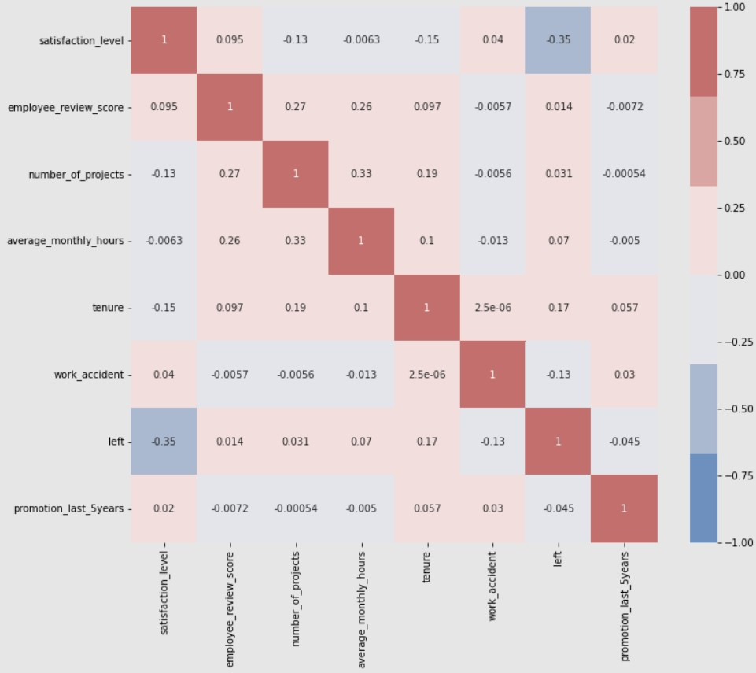
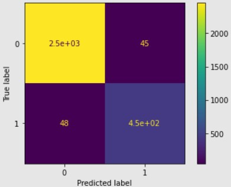
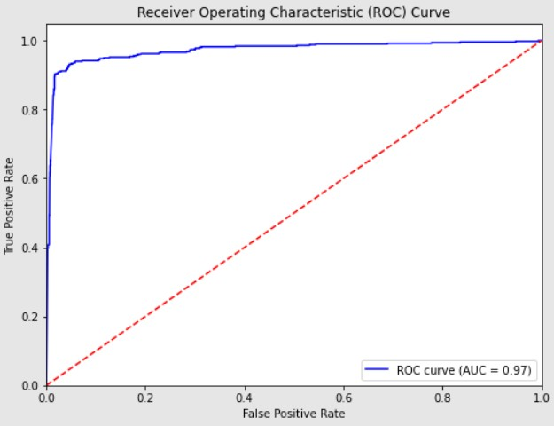
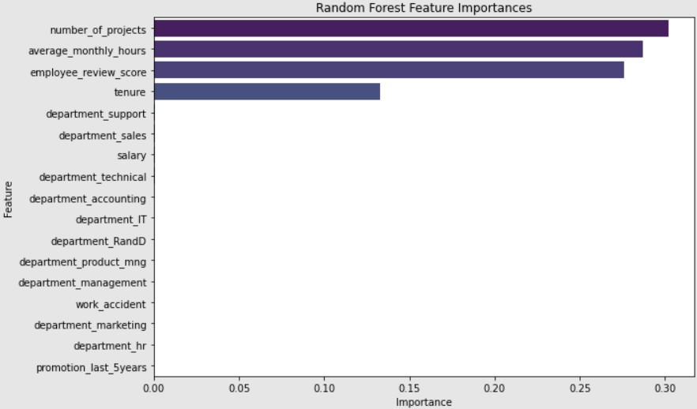

# 🚀 Employee Churn Prediction - Salifort Motors

Employee churn prediction using Decision Tree & Random Forest – Final model achieved AUC 98%, Accuracy 97.8%.

Predicting which employees are likely to leave Salifort Motors using tree-based classification models, with actionable insights to improve retention.

---

## 📌 Table of Contents

Project Overview

Dataset

Exploratory Data Analysis

Model Comparison

Evaluation Metrics

Feature Importance

Results

Conclusion & Recommendations

Next Steps

---

## 📝 Project Overview

Problem: High employee turnover is costly. Salifort Motors wants to identify which employees are most at risk of leaving.

Goal: Build predictive models to forecast attrition and uncover key drivers behind employee churn.

Target Variable: left (1 = left, 0 = stayed)

---

## 📊 Dataset

Source: Kaggle - HR Analytics and Job Prediction

Shape: 14,999 rows × 10 columns

Key Features:

Satisfaction Level

Number of Projects

Average Monthly Hours

Tenure (time_spend_company)

Promotion in Last 5 Years

Department

Salary

Last Evaluation

---

## 🔍 Exploratory Data Analysis

No missing values were found ✅

Duplicates removed, column names cleaned

Outliers explored in tenure

Target distribution:

Stayed: 83.4%

Left: 16.6%

📌 Insight: The dataset is imbalanced, with a majority of employees staying.

Correlation analysis performed using a heatmap:

  

---

## 🛠 Model Comparison

Two models were trained and cross-validated:

Decision Tree (cross-validated):

AUC: 96.9%

Precision: 91.5%

Recall: 91.7%

F1-Score: 91.6%

Accuracy: 97.2%

Random Forest (cross-validated):

AUC: 98.0%

Precision: 95.0%

Recall: 91.6%

F1-Score: 93.2%

Accuracy: 97.8%

✅ Both models performed strongly, but the Random Forest achieved the highest AUC and accuracy, making it the final chosen model.

---

## 📈 Evaluation Metrics (Random Forest – Final Choice)
Metric	Score
AUC	98.0%
Precision	95.0%
Recall	91.6%
F1-Score	93.2%
Accuracy	97.8%

- **Confusion Matrix:**  
  

- **ROC Curve:**  
  

---

## 🌟 Feature Importance

Top features influencing attrition (after removing satisfaction_level to avoid leakage):

Average Monthly Hours

Tenure (Time Spent in Company)

Number of Projects

Employee Review Score (Last Evaluation)

  

---

## ✅ Results

Both Decision Tree and Random Forest achieved strong results.

The Random Forest outperformed the Decision Tree, with an AUC of 98.0% and accuracy of 97.8%.

Key drivers of attrition were workload, tenure, and performance evaluation scores.

---

## 💡 Conclusion & Recommendations

Limit the number of projects assigned to employees.

Adjust expectations or reward employees for long working hours.

Consider promoting employees with ≥4 years tenure or investigate dissatisfaction patterns at that stage.  

---

## 🔮 Next Steps

Explore boosting methods like XGBoost or LightGBM for potential gains.

Incorporate external engagement or survey data for richer features.

Build an interactive dashboard to monitor employee churn risk in real-time. 

---
